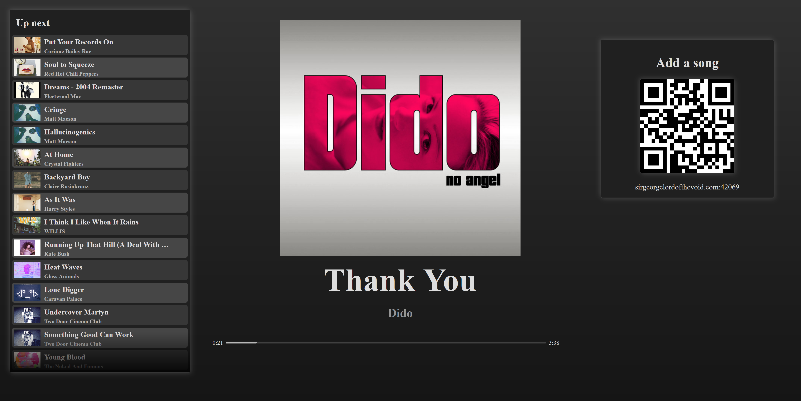
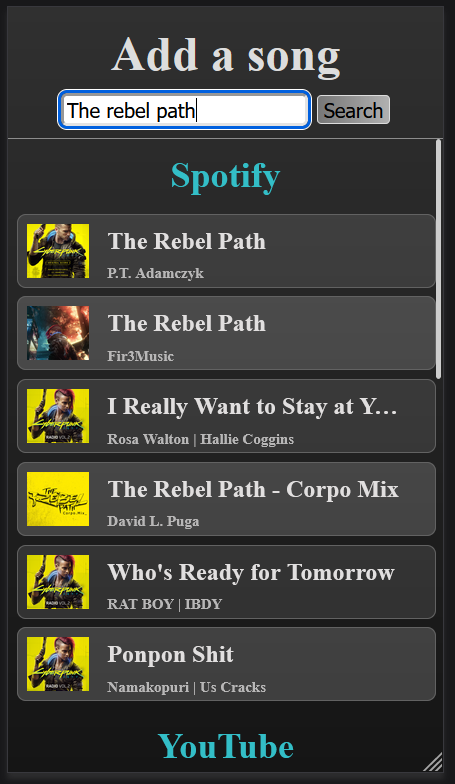

****************************
Mopidy-BigScreen
****************************

.. image:: https://img.shields.io/pypi/v/Mopidy-BigScreen
    :target: https://pypi.org/project/Mopidy-BigScreen/
    :alt: Latest PyPI version

.. image:: https://img.shields.io/github/actions/workflow/status/benreid24/mopidy-bigscreen/CI?branch=main
    :target: https://github.com/benreid24/mopidy-bigscreen/actions
    :alt: CI build status

.. image:: https://img.shields.io/codecov/c/gh/benreid24/mopidy-bigscreen
    :target: https://codecov.io/gh/benreid24/mopidy-bigscreen
    :alt: Test coverage

Mopidy frontend for big screens. Intended to be displayed on a TV while your music plays during parties. A QR code is rendered that your guests can scan to add songs to the tracklist.

TV Display
=============

Mobile Search
=============

Installation
============

Install by running::

    python3 -m pip install Mopidy-BigScreen

See https://mopidy.com/ext/bigscreen/ for alternative installation methods.

Configuration
=============

Before starting Mopidy, you must add configuration for
Mopidy-BigScreen to your Mopidy configuration file::

    [bigscreen]
    enabled = true
    add_url = yourcustomhost.com  # Optional

Specifiy the `add_url` option if you would like the QR code to point to a custom URL instead of the URL where Bigscreen is running.
One example of usage of a custom URL could be to provide an intermediate page that verifies users can access the Mopidy server
from their device: https://github.com/benreid24/Network-Verifier

Project resources
=================

- `Source code <https://github.com/benreid24/mopidy-bigscreen>`_
- `Issue tracker <https://github.com/benreid24/mopidy-bigscreen/issues>`_
- `Changelog <https://github.com/benreid24/mopidy-bigscreen/blob/master/CHANGELOG.rst>`_

Credits
=======

- Original author: `Benjamin Reid <https://github.com/benreid24>`__
- Current maintainer: `Benjamin Reid <https://github.com/benreid24>`__
- `Contributors <https://github.com/benreid24/mopidy-bigscreen/graphs/contributors>`_
